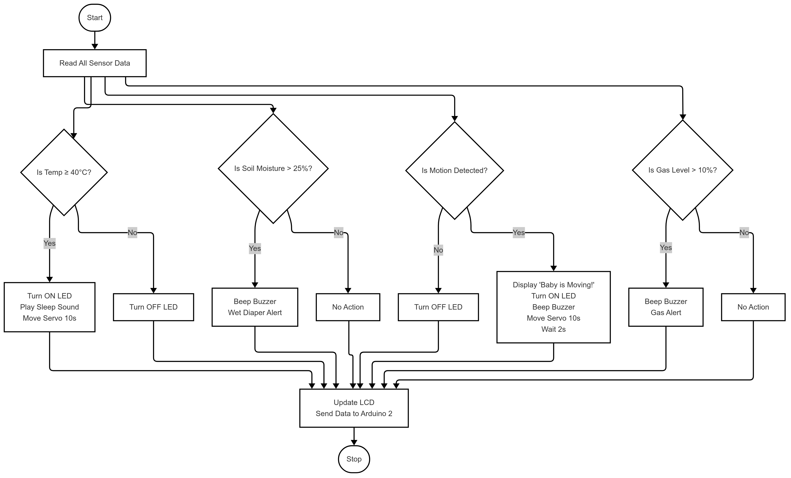
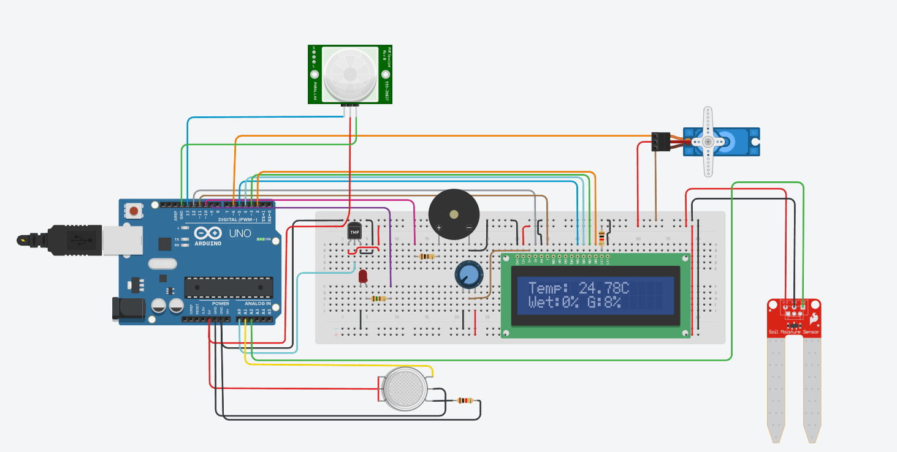
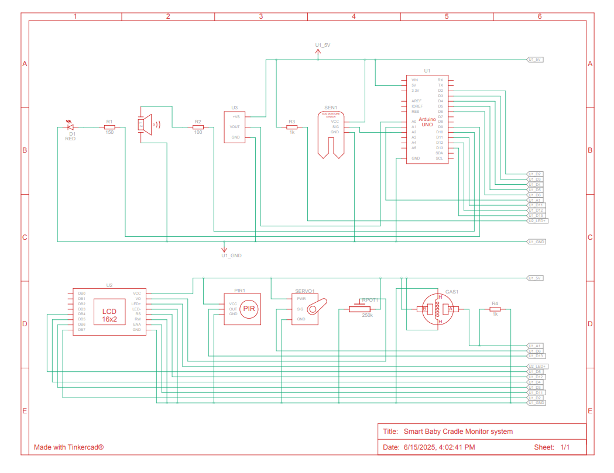
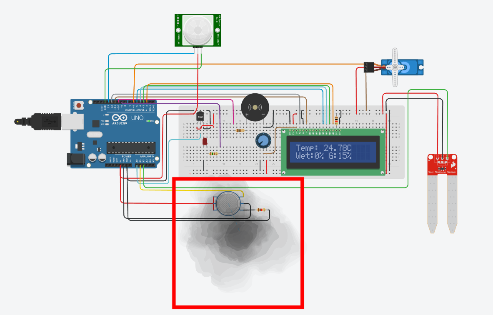
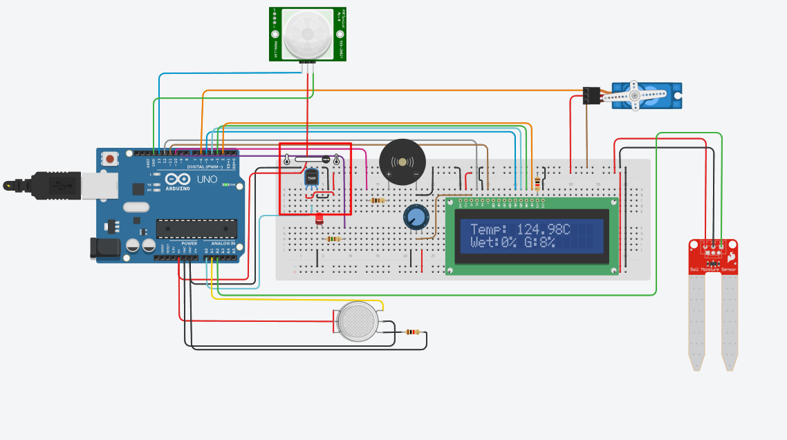
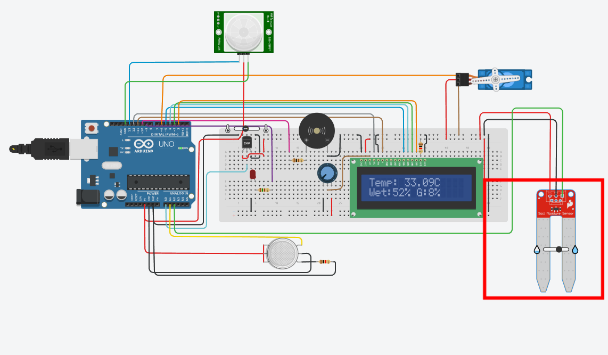

<p align="center">
  
</p>

# 👶 IoT-Enabled Smart Baby Cradle System
**Revolutionizing Child Safety & Monitoring**

A smart, sensor-based cradle system designed using IoT to enhance infant safety and caregiver convenience through real-time monitoring, automated cradle movement, and intelligent alerts.

---

## 👤 Developed By

**Rojin Baniya**  
Faculty of Computing, Engineering and The Built Environment  
Birmingham City University, United Kingdom  
📧 rojin.baniya@mail.bcu.ac.uk

---

## 📌 Project Description

This Smart Baby Cradle System monitors the baby's surrounding and status using sensors for:
- Temperature
- Gas/smoke
- Moisture (wet diaper)
- Motion (baby movement)

It responds automatically by:
- Triggering cradle movement (servo)
- Sounding buzzer/LED alerts
- Displaying status on an LCD
- (Future) Sending notifications to caregivers via mobile/cloud

---

## 🧠 Features

| Feature                | Description |
|------------------------|-------------|
| 🔥 Gas Detection       | Detects hazardous gases or smoke |
| 🌡️ Temperature Sensing | Alerts for high ambient temperature |
| 🍼 Wet Diaper Detection| Detects wet diaper using soil moisture sensor |
| 👶 Motion Detection     | Detects baby's motion/activity |
| 📟 LCD Display         | Real-time display of alerts/status |
| 🔊 Buzzer & LED        | Provides visual/audio alerts |
| 🤖 Auto Cradle Motion  | Gently rocks cradle automatically |
| ☁️ Firebase Integration| (Planned) Remote monitoring and alerts |

---

## 🔧 Components Used

| Component          | Quantity | Use |
|-------------------|----------|-----|
| Arduino Uno       | 1        | Main microcontroller |
| PIR Sensor        | 1        | Motion detection |
| Temperature Sensor| 1        | Measures ambient heat |
| Gas Sensor (MQ-2) | 1        | Detects gas/smoke presence |
| Soil Moisture     | 1        | Detects diaper wetness |
| Servo Motor       | 1        | Swings the cradle |
| LCD 16x2 (I2C)    | 1        | Displays system status |
| Buzzer, LED       | 1 each   | Alerts and indicators |
| Potentiometer     | 1        | LCD contrast tuning |
| Breadboard        | 0        | Circuit integration |

---

## 🧱 Software Stack

- **Arduino IDE** – Microcontroller programming
- **TinkerCad** – Simulation & circuit testing
- **Fritzing** – Schematic visualization
- **Mermaid.js** – Flowcharts & logic diagrams
- **Zotero** – Research citations
- **Microsoft Word** – Report writing
- **(Future)** Android Studio & Firebase – App & cloud alerts

---

## 📐 Architecture & Flow

### 🧩 Flowchart


### ⚙️ Boolean Logic


### 🧪 TinkerCad Simulation


### 🔌 Schematic Diagram


---

## 🔬 Logic Operation

| Case | Temp | Moist | Gas | Motion | LED | Buzzer | Servo | LCD Output          |
|------|------|-------|-----|--------|-----|--------|-------|---------------------|
| 1    | 0    | 0     | 0   | 0      | OFF | OFF    | OFF   | Normal              |
| 2    | 1    | 0     | 0   | 0      | ON  | ON     | ON    | High Temp Detected  |
| 3    | 0    | 1     | 0   | 0      | OFF | ON     | OFF   | Wet Diaper          |
| 4    | 0    | 0     | 1   | 0      | OFF | ON     | ON    | Gas Alert           |
| 5    | 0    | 0     | 0   | 1      | ON  | ON     | ON    | Baby is Moving      |

---

## 🧠 Boolean Logic Summary

- **LED**: `LED = (M ∧ (T ∨ G)) ∨ (T ∧ S ∧ G)`
- **Buzzer**: `Buzzer = T ∨ (S ∧ ¬G ∧ ¬M) ∨ (G ∧ ¬T) ∨ M`
- **Servo**: `Servo = T ∨ G ∨ M`

---

## 🧪 Simulation Snapshots

| Simulation | Trigger Condition        | Image |
|-----------|--------------------------|--------|
| 1         | Gas Detected              |  |
| 2         | High Temperature          |  |
| 3         | Diaper Moisture Detected  |  |
| 4         | Baby Movement Detected    |  |

---

## 📁 Project Structure

```
SmartBabyCradle/
├── images/
├── README.md
├── arduino_code/
├── report.pdf/
```

---

## 🚧 Limitations & Next Steps

- 🌍 Real-world hardware testing
- 🔐 Secure cloud + app integration
- 🔋 Battery or solar backup
- 📊 Historical data logging
- 🧠 AI/ML integration for smart alerts

---

## 🔗 Links

- 📁 [GitHub Repo](https://github.com/Rozeen-Baniya/IOT-Enabled-Smart-Baby-Cradle-System)
- 📄 [PDF Report](docs/smart-baby-cradle-report.pdf)
- 🧪 [TinkerCad Simulation](https://www.tinkercad.com/things/2Z4hPlJzU3A-smart-baby-cradle-monitor-system)
- 👨‍💻 [Developer](mailto:rojin.baniya@mail.bcu.ac.uk)

---

## 📃 License

MIT License. You are free to use, distribute, and modify with proper credit.

---

## 🙏 Acknowledgements

Thanks to mentors and collaborators from **Birmingham City University** and the open-source community.
